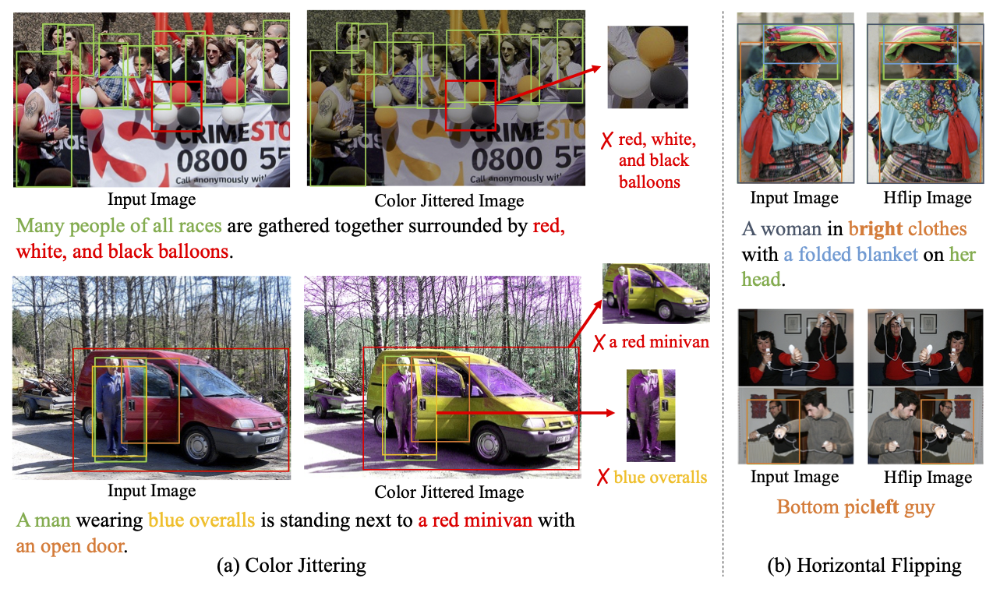
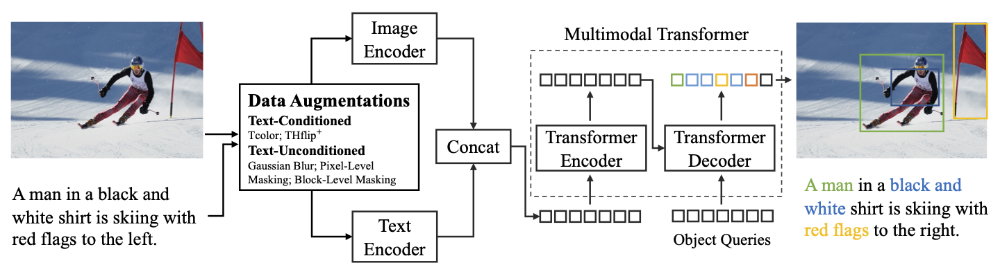
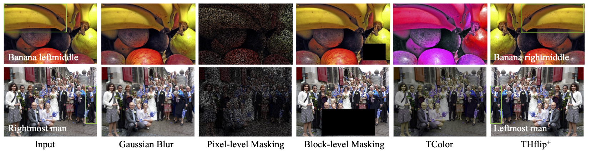
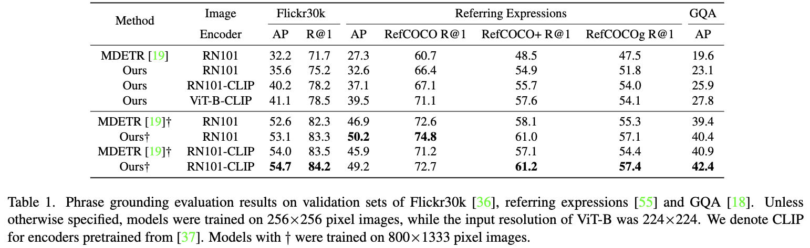

## Our Project

[WACV 2024] Augment the Pairs: Semantics-Preserving Image-Caption Pair Augmntation for Grounding-Based Vision and Language Models. (Paper link: TBD)

## Introduction

Grounding-based vision and language models have been successfully applied to low-level vision tasks, aiming to precisely locate objects referred in captions. The effectiveness of grounding representation learning heavily relies on the scale of the training dataset. Despite being a useful data enrichment strategy, data augmentation has received minimal attention in existing vision and language tasks as augmentation for image-caption pairs is non-trivial. In this study, we propose a robust phrase grounding model trained with text-conditioned and text-unconditioned data augmentations. Specifically, we apply text-conditioned color jittering and horizontal flipping to ensure semantic consistency between images and captions. To guarantee image-caption correspondence in the training samples, we modify the captions according to pre-defined keywords when applying horizontal flipping. Additionally, inspired by recent masked signal reconstruction, we propose to use pixel-level masking as a novel form of data augmentation. While we demonstrate our data augmentation method with MDETR framework, the proposed approach is applicable to common grounding-based vision and language tasks with other frameworks. Finally, we show that image encoder pretrained on large-scale image and language datasets (such as CLIP) can further improve the results. Through extensive experiments on three commonly applied datasets: Flickr30k, referring expressions and GQA, our method demonstrates advanced performance over the state-of-the-arts with various metrics. 

	

## Our Method
Propose to use text-conditioned and text-unconditioned augmentations in the phrase grounding task.

	

	

	

## How to start

The code in this repo only contains the augmentations. In our paper, we utilize the [MDETR](https://github.com/ashkamath/mdetr) as base architecture. You may incorporate the augmentations into different phrase grounding architectures. 

To use apply `hflip` augmentation randomly, we insert the augmentation to `ConvertCocoPolysToMask` function of [MDETR:datasets/coco.py](https://github.com/ashkamath/mdetr/blob/ea09acc44ca067072c4b143b726447ee7ff66f5f/datasets/coco.py#L152), where annotations are prepared when loading the training dataset. In evaluation, we disable the augmentation functions.  Other augmentations can be applied after data preparation.

## Security

See [CONTRIBUTING](CONTRIBUTING.md#security-issue-notifications) for more information.

## License

This project is licensed under the Apache-2.0 License.

